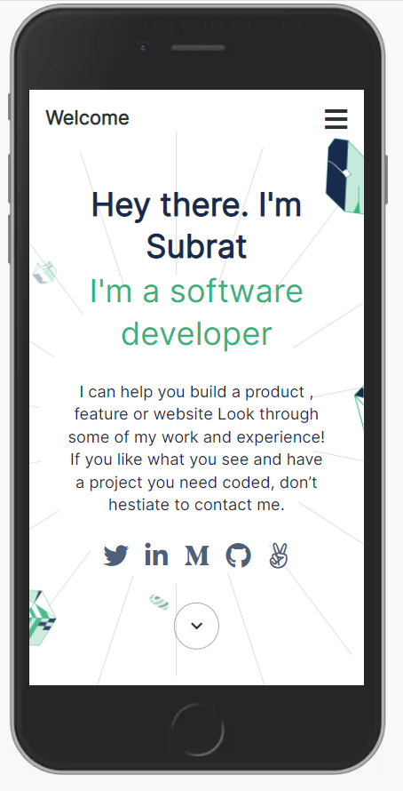

# Hello Microverse

> This is first Microverse project. 

## Built With

- HTML
- CSS

## Learning Objectives

- Create branches with different base branches.
- Understand the concept of version control.
- Follow Gitflow.
- Open pull requests in GitHub.
- Write descriptive, easy to understand commit messages.
- Write short, detailed, easy to understand descriptions of pull requests.
- Write a descriptive and easy to understand README in business English for every project submitted.
- Demonstrate an ability to submit a project for code review.

## Author

👤 **Subrat Dash**

- GitHub: [@githubhandle](https://github.com/subratsir)
- Twitter: [@twitterhandle](https://twitter.com/SubratSirIndia)
- LinkedIn: [LinkedIn](https://linkedin.com/in/subratsir)

## 🤝 Contributing

Contributions, issues, and feature requests are welcome!

Feel free to check the [issues page](../../issues/).

## Show your support

Give a ⭐️ if you like this project!

## Acknowledgments

- Hat tip to anyone whose code was used
- Inspiration
- etc

## 📝 License

This project is [MIT](./MIT.md) licensed.
